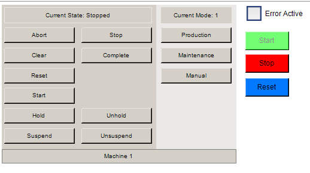

# PackML Demo

A TwinCAT 3 sample project that shows how to build PackML (ISA-TR88.00.02) machines on top of
Beckhoff's `Tc3_PackML_V3` library. It provides a reusable base module, a concrete example
module, helper utilities, a tracing framework and a local debug visualization.

## Project structure

```
PLC/
├── Machine Module/            → MachineModule: a concrete PackML module (example)
├── _Internal/
│   ├── PackML Module (Base)/  → base module for every PackML module
│   ├── Steps/                 → step helper functions
│   └── Trace/                 → tracing / logging framework (do not touch)
└── Visu (Local Debug Only)/   → visualization for local debugging only
```

## PackML Module (Base)

`_Internal/PackML Module (Base)/`

The base module is the foundation for **every** PackML module in the project — whether it
represents a whole machine or a single equipment module. It is implemented as an
`ABSTRACT FUNCTION_BLOCK PackMLModule` that wraps the Beckhoff library primitives
(`FB_PMLStateMachine`, `FB_PMLUnitModeManager`, `FB_PMLUnitModeConfig`) and exposes the
`I_PackML_Module` interface.

It gives you, for free:

- The full PackML state machine, driven each cycle from `CyclicLogic()` via the private
  `StateSelect()` / `ModeSelect()` drivers.
- One overridable `METHOD : BOOL` per PackML state — `Starting`, `Execute`, `Stopping`,
  `Aborting`, `Holding`, `Unholding`, `Suspending`, `Unsuspending`, `Resetting`, `Completing`,
  `Clearing`, and the steady states `Idle`, `Stopped`, `Held`, `Suspended`, `Aborted`,
  `Completed`.
  - For a **transient** state (Starting, Stopping, …), returning `TRUE` from its method tells
    the state machine the work is finished and it may advance to the next state.
  - **Steady** states are simply called every cycle.
- The command entry points `ChangeState(E_PMLCommand)` and `ChangeMode(DINT)`, and the
  read-only properties `CurrentState`, `CurrentMode`, `Name`.

**Usage:** create a new function block that `EXTENDS PackMLModule` and override only the state
methods your equipment actually needs (see `MachineModule` below).

## Steps

`_Internal/Steps/`

Small helper functions for writing sequential logic inside a state method, driven by the
`SequenceState : UDINT` variable of the base module (which is automatically reset to `0`
whenever the PackML state changes). Steps are conventionally numbered `0, 10, 20, …` so there
is room for minor steps in between.

| Function | Behavior | Use for |
| --- | --- | --- |
| `NextStep(SequenceState)` | Rounds down to the current multiple of 10 and adds 10 (`0→10→20…`) | Advancing to the next major step |
| `NextMinorStep(SequenceState)` | Increments by 1 (`10→11→12…`) | Sub-steps within a major step |
| `SetStep(SequenceState, Step)` | Jumps `SequenceState` to an explicit value | Loops / branching to a specific step |

```iecst
CASE SequenceState OF
    0:
        // do first part of the work …
        NextStep(SequenceState);   // → 10
    10:
        // state finished
        Starting := TRUE;
END_CASE
```

## Trace

`_Internal/Trace/` — **do not touch.**

A pluggable logging framework used to trace messages from code for debugging. Log through the
global publisher `GvlTrace.Trace`; it fans messages out to every registered logger
(`AdsLogger` → ADS/output, `TcEventLogger` → TwinCAT EventLogger), filtered by the configured
severity level (`GvlTrace.TraceLevel`).

Available methods (each takes `Source` and `Message`):

```iecst
Trace.Verbose(Name, 'Detailed diagnostic message');
Trace.Info(Name, 'Informational message');
Trace.Warning(Name, 'Something looks off');
Trace.Error(Name, 'Error occured -> Abort Statemachine');
Trace.Critical(Name, 'Critical failure');
```

Example from `MachineModule` when a simulated error is detected:

```iecst
Trace.Error(Name, 'Error occured -> Abort Statemachine');
ChangeState(E_PMLCommand.Abort);
```

## MachineModule

`Machine Module/MachineModule.TcPOU`

A single concrete example of a PackML module (`FUNCTION_BLOCK MachineModule EXTENDS
PackMLModule`). It demonstrates the intended pattern: **override only the methods from the base
module that this specific implementation needs.** Which methods a module overrides will differ
from module to module depending on the states it actually uses — a simpler module may override
fewer, a more complex one more.

Highlights of this example:

- A one-time `Initialize()` that registers the available unit modes (Production, Maintenance,
  Manual) via `FB_PMLUnitModeConfig`.
- **Mode differentiation is demonstrated in `Starting()`**: the method switches on
  `CurrentMode` (`E_PMLProtectedUnitMode.Production` vs `Maintenance` vs others) and runs a
  different startup sequence per mode. This is the reference for how to make a state behave
  differently depending on the active unit mode.
- A `SimulatedError` flag (for demo/testing): when it goes `TRUE`, `CyclicLogic()` detects the
  rising edge and **aborts the PackML state machine** via `ChangeState(E_PMLCommand.Abort)`.
  The error is **cleared again in `Clearing()`** (`SimulatedError := FALSE`), so the machine
  can be reset back into operation.

## Visu (Local Debug Only)

`Visu (Local Debug Only)/`

A CODESYS visualization (`V_Main`, `V_PackMLModule`) provided purely for **local debugging** —
it lets you drive the state machine and modes without hardware or an external HMI. **Do not use
it in a real machine.** For a production HMI, use the TwinCAT HMI (TcHMI) counterpart of this
sample instead; the base module already exposes the required symbols through
`PackMLStatemachine_HMI` / `ST_PackMLStatemachine_HMI` (decorated with `TcHmiSymbol`
attributes).



The screen is built from two objects: `V_PackMLModule` is a reusable user control (one per
module, bound to that module's `PackMLStatemachine_HMI` adapter), and `V_Main` embeds one
instance of it and adds the machine-level extras on the right.

- **State (left)** — `Current State` shows the live PackML state (`CurrentState`); the two
  columns of buttons issue PackML commands by writing `StateCommand`
  (`Abort`, `Stop`, `Clear`, `Complete`, `Reset`, `Start`, `Hold`, `Unhold`, `Suspend`,
  `Unsuspend`). These map straight onto the base module's `ChangeState(E_PMLCommand)`.
- **Mode (middle)** — `Current Mode` shows the active unit mode (`CurrentMode`); `Production`,
  `Maintenance` and `Manual` write `ModeCommand` (`1`/`2`/`3`), which the adapter forwards to
  `ChangeMode(DINT)`. These are the modes registered in `MachineModule.Initialize()`.
- **Machine controls (right)** — the coloured `Start` / `Stop` / `Reset` buttons emulate
  hardwired operator pushbuttons: they set the momentary `StartPressed` / `StopPressed` /
  `ResetPressed` inputs on the HMI adapter (TRUE while held, FALSE on release) and are
  enabled/highlighted by the matching `StartPermissive` / `StopPermissive` / `ResetPermissive`
  flags. `Error Active` is bound to `MAIN.Machine.SimulatedError` — toggling it drives the
  simulated-error path in `MachineModule` that aborts the state machine (cleared again in
  `Clearing()`).
- The footer shows the module `Name` (`Machine 1`).

## Disclaimer

All sample code provided by FlorianSiBeckhoff are for illustrative purposes only and are provided "as is" and without any warranties, express or implied. Actual implementations in applications will vary significantly. FlorianSiBeckhoff shall have no liability for, and does not waive any rights in relation to, any code samples that it provides or the use of such code samples for any purpose.
